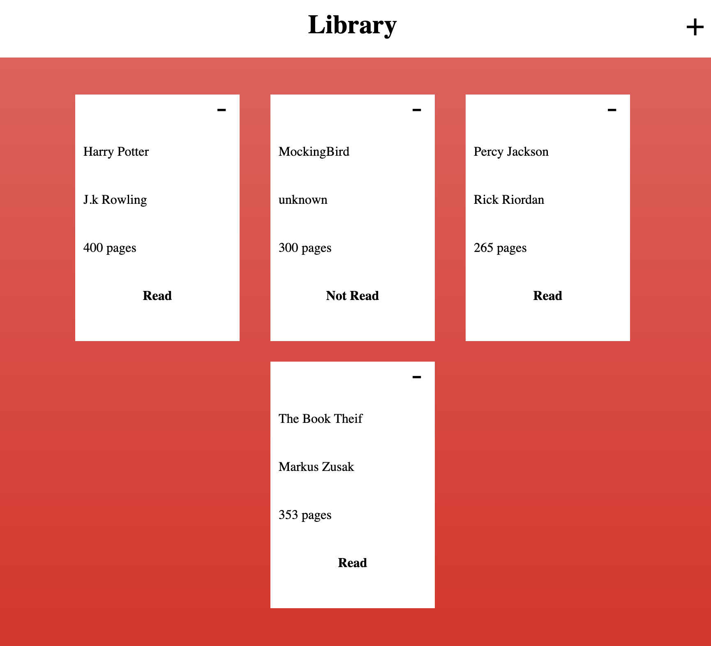

<h1>Etch-A-Sketch</h1>

Second Project I made that uses JavaScript, CSS and HTML This project was part of The Odin Project cirriculum

<h2><a href="https://taztheprogrammer.github.io/Etch-a-Sketch/">Website Preview Here</a></h2>
#must change this

<h2 style="text-align: center">Features</h2>
<ul>
  <li>Add and remove book Cards</li>
  <li>Responsive Design</li>
  <li>Simple and intuitive UI</li>
  <li>Submission Form</li>
</ul>
<h2>Outcomes</h2>
<ul>
  <li>Utilized JS objects to create html elements</li>
  <li>Utilized HTML and CSS for design</li>
  <li>Implemented Event Listeners</li>
  <li>Mainpulated css styles with JS</li>
  <li>Submit and recieve data</li>
</ul>
<h2>Links</h2>
<ul>
  <li>Next Project <b>coming soon</b></li>
  <li>Previous Project <a href="https://github.com/taztheprogrammer/Etch-a-Sketch">Recipe Page</a></li>
</ul>
